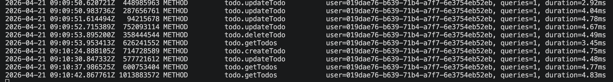

# Smart Todos

Smart Todos is a minimal, production-minded todo application built with Serverpod for the backend and Flutter for the client. It demonstrates a clean architecture, secure authentication, and real-time-like interactions with a compact API for creating, reading, updating and deleting todos.

## Key Features

- Clean Serverpod-based backend with REST/RPC endpoints
- Flutter client with native-like UI and smooth refresh patterns
- Simple auth + per-user todo persistence
- Docker-compose configuration for easy local server startup

## Architecture Overview

The project is split into three main parts:

- `smart_todos_server` — Serverpod backend, handles API endpoints, database migrations, and configuration.
- `smart_todos_flutter` — Flutter mobile app that consumes the backend API.
- `smart_todos_client` — Shared protocol/client definitions used by both server and app.

Core endpoints include todo.createTodo, todo.getTodos, todo.updateTodo and todo.deleteTodo.

## Prerequisites

- Dart/Flutter SDK (for building the client)
- Docker & Docker Compose (for running the development server easily)
- A supported IDE (VS Code, Android Studio, Xcode) for platform-specific builds

## Run Locally (recommended)

1. Start the server (from `smart_todos_server`):

```bash
cd smart_todos_server
docker compose up -d
```

2. Run the Flutter app (from `smart_todos_flutter`):

```bash
cd ../smart_todos_flutter
flutter pub get
flutter run
```

If you prefer running the server directly (non-Docker), consult `smart_todos_server/README.md` or run the Serverpod entrypoint in `bin/main.dart` with the correct environment configuration files under `config/`.

## Clone & Run (quick start)

Clone the repository and start the app locally with Docker (recommended) and Flutter:

```bash
# Clone the repository
git clone https://github.com/<your-org>/smart_todos.git
cd smart_todos

# Start the server with Docker Compose
cd smart_todos_server
docker compose up -d

# Open a new terminal to run the Flutter app
cd ../smart_todos_flutter
flutter pub get
flutter run
```

Notes:
- Replace `https://github.com/<your-org>/smart_todos.git` with your repository URL.
- If you run the server without Docker, ensure the database and environment config in `smart_todos_server/config/` are set and run the Serverpod entrypoint.

## Configuration

Configuration files for different environments are stored under `smart_todos_server/config/` (development, staging, production, test). Secrets and passwords are intentionally excluded from source control and held in `passwords.yaml` for local development only.

## API / Endpoints (high level)

- `todo.createTodo` — create a new todo for the authenticated user
- `todo.getTodos` — fetch the current user's todos
- `todo.updateTodo` — update a todo's properties
- `todo.deleteTodo` — remove a todo

Refer to `smart_todos_server/lib/src/endpoints/` for the implementation and `smart_todos_client` for the request/response types.

## Screenshots

Home screen (todo list):


Add todo flow:


Pull-to-refresh / sync:


Empty state:


Backend performance / logs example:



If any image does not render, ensure the image files are present in the `screenshots/` folder and that the filenames match exactly.

## Contributing

Contributions are welcome. Open issues for bugs or feature requests and submit pull requests with clear descriptions. Please follow the existing project style and add tests when relevant.

## License & Contact

This repository does not include a license file by default. Add a `LICENSE` file if you intend to open-source this project. For questions or support, contact the project owner.
